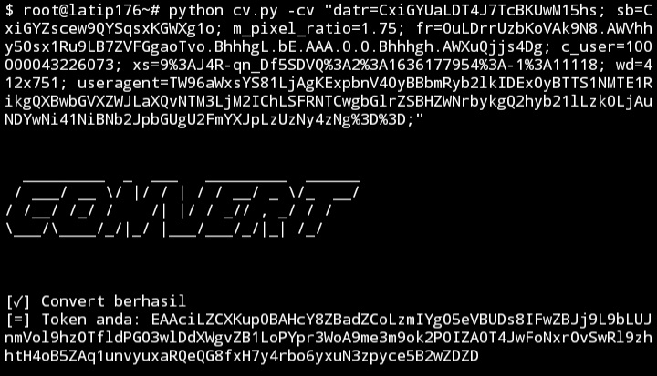

# Dokumentasi
</img>
# Info
Tools convert ```cookies facebook menjadi token``` facebook.
# Cara install
```CMD
$ pkg install python
$ pkg install git
$ git clone https://github.com/Latip176/cvToken
$ cd cvToken
```
# Cara menjalankan
</img>
ketik ```python cv.py --help``` untuk menampilkan help, dan jika
ingin convert silahkan ketik ```python cv.py -cv ("cookies facebook kamu")```
# Website, blog, dan social media
```website :``` <a href="https://latip176.my.id/">https://latip176.my.id/</a>
```blogspot:``` <a href="https://blog.latip176.my.id/">https://blog.latip176.my.id/</a>
```facebook:``` <a href="https://facebook.com/latip176.my.id/">facebook latif</a>
# Terima kasih kepada
```
- XNSCODE TEAM
```
